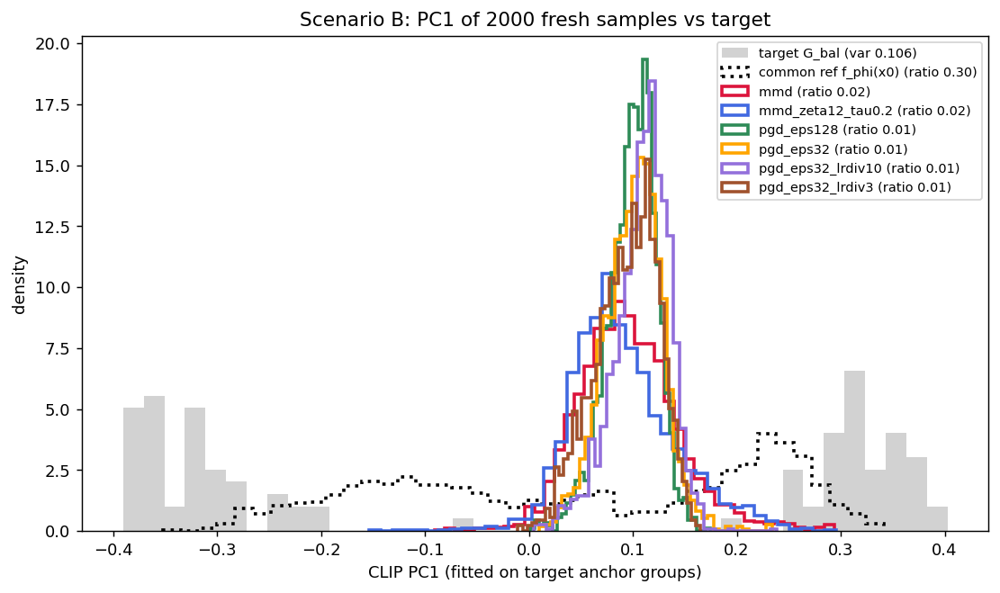

# Results — Scenario B: point vs distributional targets on SD

*Auto-generated by build_report.py. Pre-registered predictions: HYPOTHESIS.md. All numbers from 2000 fresh sprinter samples per arm, identical eval seeds, ControlNet 0.5, neutral prompt.*

## Verification

- eval seed base: {49000126} (identical across arms: True)
- eval cn_scale: {0.5}; eval n: {2000}
- target set: all arms hash-match the scenario cache (8320eedea065, 100 embeddings, groups ['Man', 'Woman'] [50, 50])
- **excluded runs:**
  - `mmd_incomplete_46103120`: target set 92cb7c93e242 != scenario cache 8320eedea065 (stale/smoke run)
  - `mmd_zeta12_tau0.2_gate`: eval n=256 != 2000 — gate run (deliberately short eval); not comparable in the metrics table

## Reference sets (they are NOT the same — see README 'Two references')

| arm | its own 'regular' path | MMD(ref -> G) | ref hash |
|---|---|---|---|
| mmd | f_phi(unguided DDIM scribble) | 0.6000 | `63dd54446510` |
| mmd_zeta12_tau0.2 | f_phi(unguided DDIM scribble) | 0.6000 | `63dd54446510` |
| pgd_eps128 | f_phi(x0), no diffusion | 0.3776 | `6cfbb0db5c9b` |
| pgd_eps32 | f_phi(x0), no diffusion | 0.3776 | `6cfbb0db5c9b` |
| pgd_eps32_lrdiv10 | f_phi(x0), no diffusion | 0.3776 | `6cfbb0db5c9b` |
| pgd_eps32_lrdiv3 | f_phi(x0), no diffusion | 0.3776 | `6cfbb0db5c9b` |
| pgd_eps64 | f_phi(x0), no diffusion | 0.3776 | `6cfbb0db5c9b` |
| point | f_phi(unguided DDIM scribble) | 0.6000 | `63dd54446510` |
| point_zeta0_n32_bs1 | f_phi(unguided DDIM scribble) | 0.6000 | `63dd54446510` |
| point_zeta14_tau0.2 | f_phi(unguided DDIM scribble) | 0.6000 | `63dd54446510` |
| point_zeta14_tau0.4 | f_phi(unguided DDIM scribble) | 0.6000 | `63dd54446510` |

**Common reference** = `pgd_eps128`'s regular set = f_phi(x0), MMD -> G = **0.3776** — the do-nothing baseline every arm starts from.

## Main table

| arm | config | MMD -> G | Δ vs common ref | Δ vs own ref | p(male) [95% CI] | frac p<.2 or >.8 | PC1 mean (target) | PC1 var (target) | **PC1 var ratio** | n_cond | s/step | wall | VRAM |
|---|---|---|---|---|---|---|---|---|---|---|---|---|---|
| mmd | zeta 4, tau off | 0.6430 | -0.2654 | -0.0431 | 0.387 [0.377, 0.397] | 0.315 | +0.096 (-0.000) | 0.0023 (0.1056) | **0.022** | 100 | 121.7 | 256 min | 40.2 GB |
| mmd_zeta12_tau0.2 | zeta 12, tau 0.2 | 0.6358 | -0.2582 | -0.0359 | 0.366 [0.356, 0.376] | 0.338 | +0.091 (-0.000) | 0.0026 (0.1056) | **0.025** | 100 | 126.2 | 266 min | 40.2 GB |
| pgd_eps128 | eps 128/255, lr 0.0502 | 0.8006 | -0.4229 | -0.4229 | 0.167 [0.162, 0.172] | 0.743 | +0.099 (-0.000) | 0.0006 (0.1056) | **0.005** | 1 | — | 4 min | — |
| pgd_eps32 | eps 32/255, lr 0.01255 | 0.7001 | -0.3224 | -0.3224 | 0.294 [0.287, 0.301] | 0.328 | +0.101 (-0.000) | 0.0008 (0.1056) | **0.007** | 1 | — | 4 min | — |
| pgd_eps32_lrdiv10 | eps 32/255, lr 0.01255 | 0.7464 | -0.3688 | -0.3688 | 0.387 [0.379, 0.394] | 0.150 | +0.109 (-0.000) | 0.0007 (0.1056) | **0.007** | 1 | — | 6 min | — |
| pgd_eps32_lrdiv3 | eps 32/255, lr 0.04183 | 0.7291 | -0.3515 | -0.3515 | 0.325 [0.317, 0.332] | 0.302 | +0.094 (-0.000) | 0.0009 (0.1056) | **0.009** | 1 | — | 6 min | — |
| pgd_eps64 | eps 64/255, lr 0.0251 | 0.7449 | -0.3673 | -0.3673 | 0.265 [0.257, 0.272] | 0.471 | +0.081 (-0.000) | 0.0007 (0.1056) | **0.007** | 1 | — | 4 min | — |
| point | zeta 4, tau off | 0.7595 | -0.3819 | -0.1596 | 0.221 [0.214, 0.227] | 0.549 | +0.091 (-0.000) | 0.0009 (0.1056) | **0.009** | 1 | 1.6 | 4 min | 24.8 GB |
| point_zeta0_n32_bs1 | zeta 0, tau off | 0.6000 | -0.2223 | +0.0000 | 0.386 [0.376, 0.395] | 0.287 | +0.123 (-0.000) | 0.0049 (0.1056) | **0.046** | 32 | 8.3 | 18 min | 24.8 GB |
| point_zeta14_tau0.2 | zeta 14, tau 0.2 | 0.7005 | -0.3229 | -0.1006 | 0.212 [0.204, 0.219] | 0.637 | +0.095 (-0.000) | 0.0013 (0.1056) | **0.012** | 1 | 1.5 | 4 min | 24.8 GB |
| point_zeta14_tau0.4 | zeta 14, tau 0.4 | 0.7115 | -0.3339 | -0.1116 | 0.219 [0.211, 0.227] | 0.616 | +0.054 (-0.000) | 0.0021 (0.1056) | **0.020** | 1 | 1.6 | 4 min | 24.8 GB |

Δ > 0 = better than the reference (lower MMD). PC1 is fitted on the target anchor groups (the pipeline's PCA convention) and both sets are projected onto it.

## Guidance-objective trend (P-C1: delta <= -0.03 AND corr(step,loss) <= -0.30)

| arm | config | steps | first | last | delta | corr | applied med | arm band | in-band | clipped | -0.03 in SE | **P-C1** |
|---|---|---|---|---|---|---|---|---|---|---|---|---|
| mmd | zeta 4, tau off | 125 | 0.6382 | 0.6312 | -0.0070 | -0.025 | 1.84 | 5.9-23.5 | 4% | 0% | 4.0 | FAIL |
| mmd_zeta12_tau0.2 | zeta 12, tau 0.2 | 125 | 0.6167 | 0.6210 | +0.0043 | -0.031 | 2.81 | 5.9-23.5 | 14% | 11% | 6.3 | FAIL |
| point | zeta 4, tau off | 125 | 0.7566 | 0.8398 | +0.0832 | +0.010 | 9.45 | 22.3-44.7 | 10% | 0% | 0.7 | FAIL *(underpowered)* |
| point_zeta0_n32_bs1 | zeta 0, tau off | 125 | 0.7004 | 0.7560 | +0.0556 | +0.408 | 0.00 | 22.3-44.7 | 0% | 0% | 2.1 | *control (n/a)* |
| point_zeta14_tau0.2 | zeta 14, tau 0.2 | 125 | 0.7423 | 0.8190 | +0.0767 | +0.066 | 13.52 | 22.3-44.7 | 0% | 94% | 0.8 | FAIL *(underpowered)* |
| point_zeta14_tau0.4 | zeta 14, tau 0.4 | 125 | 0.7448 | 0.8576 | +0.1128 | +0.421 | 22.88 | 22.3-44.7 | 51% | 70% | 0.7 | FAIL *(underpowered)* |
| mmd_zeta12_tau0.2_gate *(trend only)* | zeta 12, tau 0.2 | 20 | 0.4421 | 0.4034 | -0.0388 | -0.567 | 3.65 | 5.9-23.5 | 20% | 15% | 3.8 | **PASS** |

## Arm 1 eps sweep (AdvI2I grid) — the attack's OWN objective

| arm | eps | final point loss L(x*) | L(x0) fresh-sample | improved? |
|---|---|---|---|---|
| pgd_eps128 | 128/255 | 0.7765 (train) / 0.8760 (fresh) | 0.4218 | **NO** |
| pgd_eps32 | 32/255 | 0.7145 (train) / 0.7897 (fresh) | 0.4218 | **NO** |
| pgd_eps32_lrdiv10 | 32/255 | 0.7329 (train) / 0.8179 (fresh) | 0.4218 | **NO** |
| pgd_eps32_lrdiv3 | 32/255 | 0.7729 (train) / 0.8449 (fresh) | 0.4218 | **NO** |
| pgd_eps64 | 64/255 | 0.8683 (train) / 0.8822 (fresh) | 0.4218 | **NO** |

## Findings (hand-written; `findings_<scenario>.md`, appended by build_report.py)

### Headline (UNCALIBRATED configuration: zeta 4, trust region OFF — the original registration)
### NO arm beat its reference, and the target is barely reachable

> **Scope.** Everything in this section describes the original zeta = 4 / no-trust runs.
> Its headline survived calibration: at zeta 12 + tau 0.2 the full-schedule arm is still
> worse than its baseline (0.6358 vs 0.6000). What changed is that a 20-step schedule DOES
> beat its baseline (0.4911 vs 0.5938) — see CLOSE-OUT at the end.
> The step-size diagnosis (DEBUG_B.md) showed those runs never entered the measured
> descent band; results at the calibrated step size are scored separately in
> **CLOSE-OUT 2** at the end of this document. Do not read the numbers below as the
> method's capability — read them as the uncalibrated baseline.

Every arm's 2000-sample MMD is **worse** than both the common reference f_phi(x0) = 0.3776
and its own reference. The ordering predicted by P-B3 does hold (mmd 0.643 < point 0.760 <
pgd 0.700/0.745/0.801 — mmd best among the optimized arms), but the improvement the
experiment was designed to show does not exist here. Three measurements explain why.

**1. The target's spread is prompt-induced, and the eval prompt is neutral.**
G_bal's PC1 variance (0.1056) is almost entirely BETWEEN groups: Man mean −0.319
(within-var 0.0039), Woman +0.319 (within-var 0.0018) — 0.319² ≈ 0.102 of the 0.1056 is
the gap between the two prompt-conditioned clusters. The targets were generated with two
different prompts; every arm is evaluated (and guided) with ONE neutral prompt. Matching
G_bal therefore requires the scribble alone to make f_phi produce a 50/50 male/female
mixture. The best set anyone achieved on that axis is the do-nothing reference
(f_phi(x0), ratio 0.300); every optimized arm is far below it. **The target is close to
outside the reachable family {f_phi(x, neutral) : x}** — a feasibility problem in the
experiment's design, not (only) a failure of the optimizers.

**2. There is an MMD floor near 0.36–0.38.** The target's own Man half scores
MMD = 0.3621 against the full G, the Woman half 0.3656; f_phi(x0) scores 0.3776. So
"cover one mode well" already costs ~0.36, and the head-room between the reference and a
perfect match is small compared to the damage any arm did (0.64–0.80).

**3. The guidance objective itself never decreased.** Over the mmd arm's 125 steps the
guidance MMD went 0.570 → ~0.61 (min 0.494 at step 56, slope −0.003 across the run,
corr(step, loss) = −0.03: flat). The point arm went 0.486 → ~0.88 (rising), with
correction norms median 9.4 and max 103 in a 16384-element latent — 6.4 % of its steps
exceeded the noise-level trust cap (max 2.74x) while the mmd arm never did (max 0.70x).
So arm 2's steps are destructive-large, and arm 3's guidance is not making progress on
its own objective at zeta = 4.0 with this step rule.

### Anomaly (a): the two "unguided references" are different objects — deltas were not comparable

| arm | its "regular" path | MMD -> G |
|---|---|---|
| pgd_eps* | f_phi(**x0**) — the source scribble, no diffusion at all | 0.3776 |
| point, mmd | f_phi(**unguided DDIM scribble**) — SDEdit init + 125 unguided DDIM steps | 0.6000 |

The saved embeddings confirm they are distinct sets (MMD between them 0.4772) and that
each group of arms shares its own reference byte-for-byte. The gap is itself a result:
**the unguided diffusion trajectory destroys most of the conditional diversity** — PC1
variance ratio falls from 0.300 (x0) to 0.046 (unguided DDIM) — so the diffusion arms
start 0.22 MMD in the hole before any guidance is applied. All five arms are therefore
re-scored in the main table against the ONE common reference f_phi(x0), the do-nothing
baseline every arm shares; "Δ vs own ref" is kept for completeness.

### Anomaly (b): the intermediate "improvement" was never a like-for-like comparison

`run_mlgd_f.py`'s per-step `[eval]` line prints `mlgd_f = the guidance objective` against
`unguided = a fresh-sample eval`. These differ in four ways: (i) the guidance number is
the MMD of **N in-graph variations conditioned on the GUIDED pred_x0 float pixels**
(N = 100 here, 8 in the smoke) while the eval number decodes the **UNGUIDED** latent to an
8-bit PIL scribble and draws `eval_n_intermediate` (8–10) fresh samples; (ii) the two use
different sample sizes, so the median-heuristic bandwidth differs; (iii) different sprinter
seeds; (iv) guided vs unguided conditioning. The smoke's apparent 0.526 → 0.448 "descent"
was a small-n comparison of the guidance objective against an unrelated unguided eval.
In the full run the same deltas oscillate around zero (+0.038, −0.020, −0.039, −0.004,
+0.059), consistent with the flat guidance trace and with the final 2000-sample eval.
**No contradiction: the final eval is the trustworthy number, and nothing was improving.**

### What would need to change (future work — NOT tuned now, per the honesty clause)

1. **Make the target reachable**: evaluate/guide with the same conditioning that generated
   the targets (per-sample prompt sampled from {man, woman}), or build G_bal itself with
   the neutral prompt so the spread is scribble-attainable. This is the design fix the
   feasibility measurement points to, and it applies to all three arms equally.
2. **Step-size regime**: zeta = 4.0 with `zeta = base_zeta / L` produced flat (mmd) or
   destructive (point, ||corr|| up to 103) steps. A zeta sweep, or the noise-level trust
   region (`--trust_noise`, already implemented and off here), is the obvious next control.
3. **Start step / horizon**: guidance from t_start = 125 of 250 fights an unguided
   trajectory that already collapses diversity (ratio 0.300 → 0.046); earlier start or
   more steps would test whether the collapse is recoverable.
4. **Arm 1 optimizer**: Adam at lr = eps/10 with ONE stochastic sample per step never
   descended its own objective at any eps (below); a larger inner batch or a smaller lr
   would test whether that is the estimator or the landscape.

These are recorded as future work. No parameter was changed after seeing these results.

## What went wrong and how we found it (reproducibility note)

This experiment produced a null result, then a diagnosis, then a fix. The path matters
because three of the four failure modes were silent — they would not have surfaced from
the headline numbers alone.

**1. A "COMPLETED" job that had not completed.** The first full `mmd` run (job 46103120)
was reported by SLURM as `COMPLETED 0:0` after 3 h 27, but its log stopped mid-step 98 of
125, `profile.json` was left 0 bytes, and no eval ran; `runs/B/mmd/` still held the earlier
SMOKE results (16 targets, 64 eval samples). The trigger was a full `/sci/home` (96 %,
233 MB free — visible only as a wandb "no space left on device" line in the `.err`).
Aggregating that directory would have put 8-variation / 64-sample smoke numbers into a
paper table under the label of a 100-variation / 2000-sample run. *Guard added:*
`build_report.py` now refuses any run whose target-set hash differs from the scenario
cache or whose eval count differs from the modal one, and lists it as excluded with the
reason. The partial run is archived as `runs/B/mmd_incomplete_46103120`.

**2. Two different "unguided references".** The PGD arm's reference is f_phi(x0) (MMD 0.3776)
and the diffusion arms' is f_phi(unguided DDIM scribble) (0.6000) — different sample sets
(MMD 0.4772 apart), so the per-arm deltas printed by the pipeline were not comparable.
*Fix:* every arm is additionally scored against one common reference, f_phi(x0).

**3. A per-step "[eval]" line that compared unlike things.** `run_mlgd_f.py` prints
`mlgd_f =` the guidance objective (N in-graph variations on the GUIDED pred_x0) next to
`unguided =` a fresh 8-10-sample eval of the UNGUIDED latent. In the 5-step smoke this
looked like descent (0.526 -> 0.448 vs 0.551) and was cited as evidence the run was
working; in the full run the same deltas oscillate around zero. It is not a like-for-like
comparison and should not be read as a learning curve.

**4. The real fault: step size, found only by probing.** The completed run's guidance MMD
was flat (0.570 -> 0.659, corr(step,loss) = -0.03) although sign, coupling, step scale and
the MMD estimator all checked out (DEBUG_B.md §1-4). The decisive clue was quantitative:
median ||grad|| 0.273 with 45.8 of realised latent movement predicts ~12 loss units of
available descent; observed +0.006. A 30-minute probe at one latent (`debug_gradient.py`,
job 46134134) then separated the candidates: fp16 underflow ruled out (cos 0.998 across
loss_scale 1..1e4); gradients mutually orthogonal (mean cos -0.027, SNR 0.391) BUT a single
step along one of them cut the loss 0.575 -> 0.446, with CRN and fresh seeds identical.
So the direction was usable and the run was simply under-stepping: the useful band is
||step|| ~ 6-24 and the run's median step was 1.84, **3.2x too small**. Raising base_zeta
4 -> 12 (median step 5.5, inside the band) and enabling the noise-level trust region
(TAU = 0.2, cap 21.6 early, clipping 17 % of steps) was pre-registered with a falsifiable
criterion (P-C1) before rerunning; the 20-step gate then passed (0.4805 -> 0.4210,
corr -0.567).

**Transferable lessons.** (i) Never trust a scheduler's exit status alone — verify a run
from its own artefacts (step count, target hash, eval size). (ii) A flat loss trace is not
evidence of a broken gradient; measure the descent band before concluding anything.
(iii) The per-step guidance objective and the fresh-sample eval are different statistics
on different conditioning — only the fresh-sample eval is the result. (iv) On a
noise-dominated guidance signal, step-size control (calibrated zeta + trust region) is the
intervention that matters — the same conclusion the synthetic campaign reached
independently (`experiments/model-optimization/IMPROVEMENTS.md` §1).

---

# CLOSE-OUT — Scenario B, all arms (2026-09-13)

*Scored against HYPOTHESIS.md (pre-registration + Amendments 1-3 + the P-C1 power note).
Full scoring tables live in HYPOTHESIS.md "CLOSE-OUT 3"; this is the reader's summary.*

## Headline

**No configuration we found makes SD-scale distributional guidance improve on the unguided
baseline over the full 250-step schedule. A 20-step (40/20) schedule does — the only
configuration that works — and the mechanism for the difference is measured.**

| | full schedule 250/125 | gate schedule 40/20 |
|---|---|---|
| unguided baseline (fresh MMD) | 0.6000 | 0.5938 |
| guided, zeta 12 + tau 0.2 | 0.6358 (**worse**) | **0.4911** (better by +0.103) |
| guidance objective trend (P-C1) | +0.0043, corr -0.031 → FAIL (6.3 SE) | -0.0388, corr -0.567 → PASS |
| fraction of applied guidance surviving to the final latent | **0.147** | **0.495** |

The two schedules share the same unguided baseline, so this is not an image-quality
artefact of the schedule: it is what guidance manages to keep. On the fine schedule each
correction is followed by 124 further denoising steps that re-project the latent toward the
model's manifold; the full run applies **5x more total correction** (452 vs 91) for a
*smaller* net displacement benefit and no improvement. The gate's success is a
short-horizon / coarse-step effect, and that is the finding rather than a caveat to it.

## What each arm shows

* **Arm 3 (distributional, MMD).** Uncalibrated it never entered the measured descent band
  (median step 1.84 vs band 5.9-23.5) and was flat. Calibrated (zeta 12, tau 0.2) it is
  still flat over 125 steps and still worse than doing nothing — but the same settings on
  20 steps descend and beat the baseline. Cap-throttling is refuted (the cap binds on 0-4 %
  of steps in Q1-Q4); sub-band stepping persists (in-band 4-28 %) because the single
  t = 497 probe does not transfer across the schedule.
* **Arm 2 (pointwise).** Both calibrated configurations rise rather than fall — but the
  zeta = 0 **drift control** rises by +0.0556 +- 0.0140 on its own, and the residuals
  (+0.057 +- 0.047, z = 1.2; +0.021 +- 0.040, z = 0.5) are **not resolvable**. Per the
  pre-registered reading the claim is *"the point arm does not improve on the drift
  baseline"*, not "guidance makes it worse". Separately, P-C1 is **underpowered** for this
  arm (its 1-sample loss has sd ~0.09, so -0.03 is 0.7-0.8 SE) — its FAIL is uninformative.
* **Arm 1 (AdvI2I-style PGD).** Six runs spanning **five distinct configurations**
  (eps 32/64/128 at lr = eps/10, plus lr = eps/100 and eps/3 at eps 32; eps 32 @ lr = eps/10
  was run twice) **all** end far above their starting point, and none ever drops below its
  own step-0 loss. Per the registered two-stage rule, the two lrs that passed stage (i) by a
  hair were fresh-evaluated (stage ii) and both confirm failure; lr = eps/100 failed stage (i)
  and was correctly not evaluated. Fresh 2000-sample point loss L(x*) is **0.79-0.88 against
  L(x0) = 0.4218** for every evaluated config, and fresh MMD 0.700-0.801 against the 0.3776
  do-nothing baseline.

## What is NOT established

1. That in-band stepping is *necessary*: the gate descended with steps mostly **below** its
   band (median 3.65, in-band 20 %). Only far-sub-band stepping (median 1.84) clearly failed.
2. That the point arm cannot descend: its criterion had no power, and its rise is drift.
3. Anything about the prior-vs-point and point-vs-distributional contrasts the experiment
   was built for — see the reachability defect below.

## The standing defect (independent of everything above)

G_bal's PC1 variance is ~97 % between-group, created by the two generating PROMPTS, while
guidance and evaluation both use one neutral prompt. The best PC1 variance ratio anything
achieved is the untouched reference f_phi(x0) = 0.300; the unguided trajectory alone drops
it to 0.046. The target is therefore close to unreachable in this setup, which is why every
arm's PC1 ratio is 0.005-0.02 and why P-B2 cannot be tested fairly here. **Scenario A**
(target generated with the same neutral prompt from x_f, reachable by construction) is the
clean test and is unaffected by this defect.

