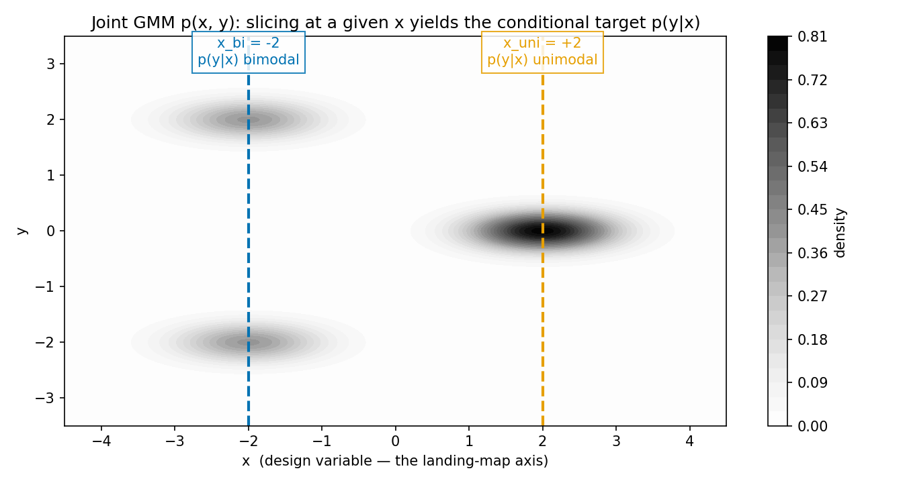
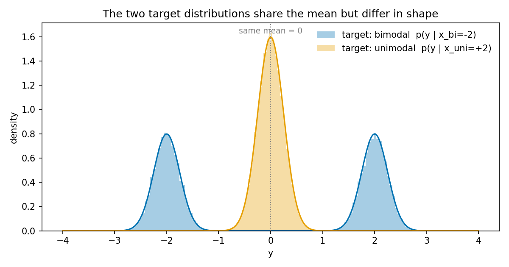
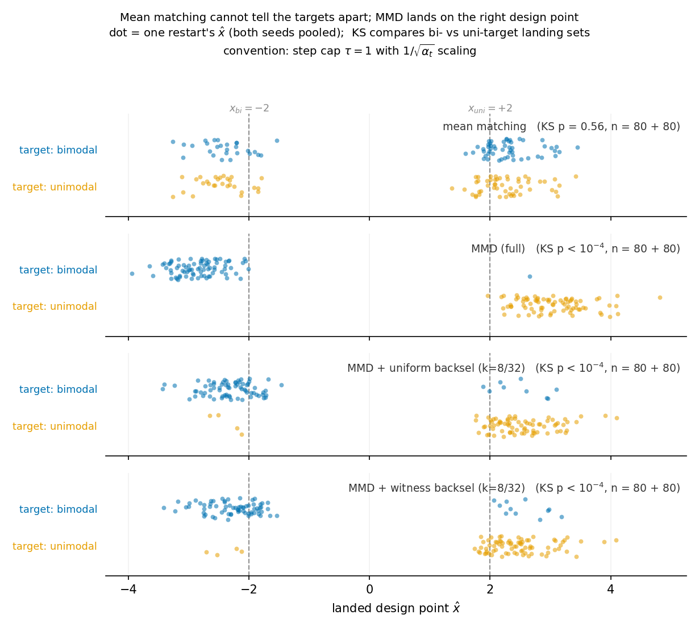
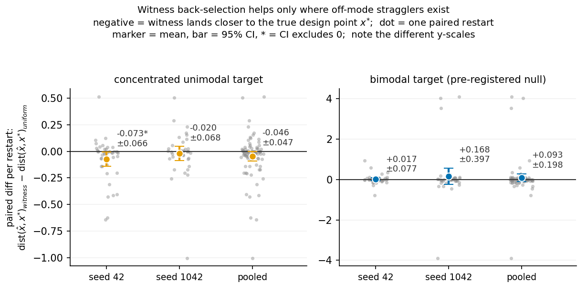
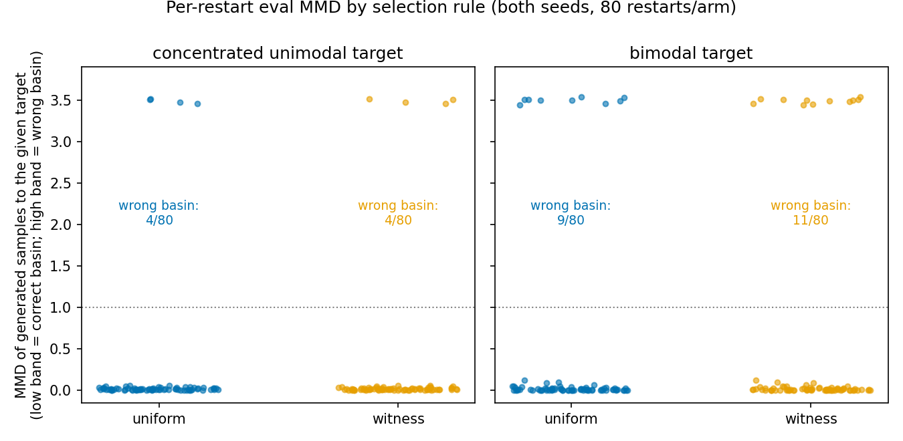
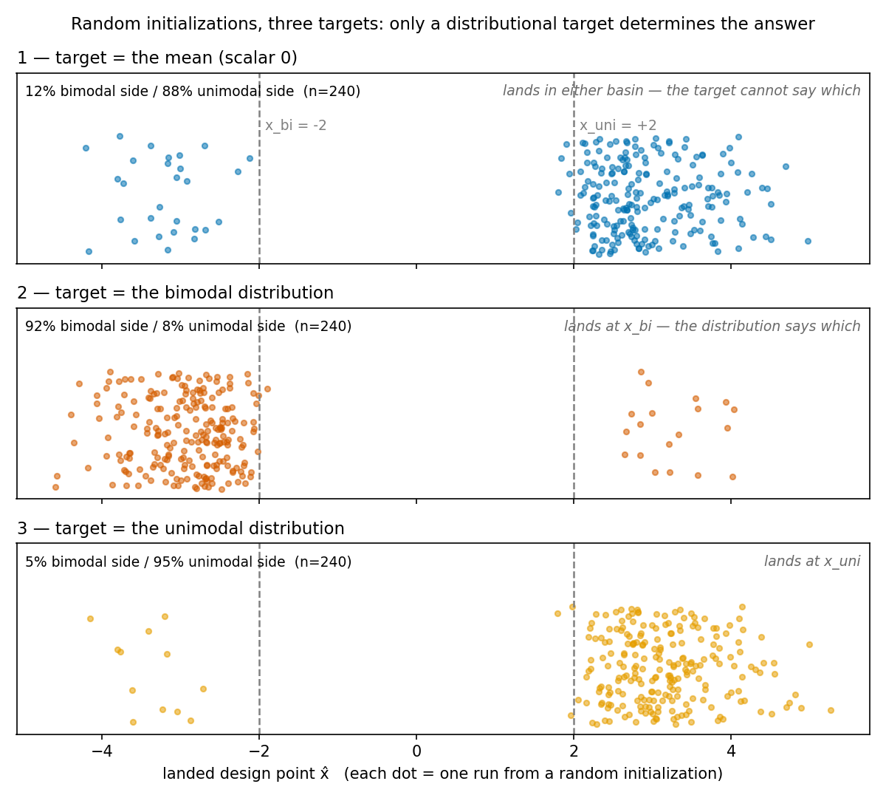

# witness_unimodal — mean-blindness & witness back-selection on concentrated unimodal targets

Self-contained experiment directory (branch `claude/witness-function-simulation-analysis`).
Everything for this analysis lives here; no files elsewhere in the repo are modified.

## Hypothesis (pre-registered — read first)

See [HYPOTHESIS.md](HYPOTHESIS.md). Short version: a 50/50 bimodal target at ±c and a
concentrated unimodal target N(0, s²) share the same mean, so mean-matching guidance
literally cannot tell them apart; MMD can. And witness-function back-selection
(|w(e)| ∝ how badly a generated sample sits relative to the target) should beat
uniform back-selection MOST on the concentrated unimodal target, where the mismatch
is carried by a few off-mode stragglers.

## Design (Stage 1 — synthetic)

- Setting: the repo's `2D_cond_1D` toy (1-D y | 1-D x), pretrained seed-42 checkpoints
  (auto-downloaded from the sweep scripts' HF fallback repo into
  `simulations/checkpoints/2D_cond_1D/`, which is gitignored).
- Targets (all mean 0): `bimodal_c1`, `bimodal_c2` (±c, component std 0.1);
  `unimodal_s010`, `unimodal_s025`, `unimodal_s050` (N(0, s²)).
- Arms: `mean` (‖mean−mean‖²), `mmd` (full), `mmd_uniform` (k=8 of n=32, uniform),
  `mmd_witness` (same k, |witness| sampling, floor 0.3). Arm 5 (trust-style step cap)
  dropped — `optimize_LGD` on this branch has no cap toggle.
- Paired restarts: same `set_run_seed(seed, i)` per restart index across all
  arms/targets; ≥40 restarts on the cluster, 8 in the local smoke.
- Metrics (n_eval=256 fresh conditional samples at the returned x): final MMD to
  target, |mean error|, std(y_gen), fraction within 2·(mode scale) of the nearest mode.

## How machinery is reused (and the two deviations)

Arms `mmd*` call `simulations/src/Optimization.optimize_LGD` unmodified, using its
own `backsel_k/backsel_rule/witness_floor/backsel_generator` hooks
(`simulations/src/witness_utils.py`); models/params load via
`simulations/scripts/witness_sweep_common.py`. Deviations (documented in
`exp_witness_unimodal.py`'s docstring):

1. **Mean arm**: `optimize_LGD` hardcodes `MMDLoss` (its `loss=` arg is ignored), so
   the mean arm is `optimize_mean_matching()` — a line-for-line twin of the loop with
   only the per-j loss replaced.
2. **`import ot` stub**: `LossFunctions.py` imports POT but never uses it; POT isn't
   in the local env and pip installs are off-limits, so an empty module is registered
   iff `ot` is absent.
3. **Step cap (round 2, opt-in)**: `--step_cap_tau 1.0` applies the noise-level
   trust region ‖Δ_t‖ ≤ τ·√(1−ᾱ_t) to the guidance correction of ALL FOUR arms
   symmetrically (the mean arm's norm clip is then off), because raw `optimize_LGD`
   restarts diverge off-manifold (round-1 verdict V2 in VERDICTS.md). Implemented
   entirely in `exp_witness_unimodal.py` (`optimize_capped`, a replicated minimal
   loop — monkeypatching was infeasible, the update is inline); Ori's files untouched.
   Default off = round-1 behaviour. `build_report.py` keeps cap/no-cap regimes separate.
4. **Mean-arm gradient clip** (found during the smoke run, amended before any mean-arm
   numbers were recorded): the multi-bandwidth-RBF MMD is bounded so `optimize_LGD`'s
   raw `zeta*grad` update is always tame, but the unbounded quadratic mean loss has
   positive feedback through the sampled conditional chain and diverges to NaN within
   ~10 diffusion steps at `zeta=1`. The mean arm clips its gradient NORM
   (`--mean_grad_clip`, default 1.0) — step direction (pure mean matching, the
   property under test) is unchanged. MMD arms are untouched.

`exp_witness_unimodal.py` also refuses to fall into `load_or_train_models`' silent
20k-epoch local training when checkpoints are unavailable (`--allow_train` overrides).

## How to run

```bash
# local smoke (8 restarts, {bimodal_c1, unimodal_s025}, all four arms):
/Users/stolk/miniconda3/bin/python experiments/witness_unimodal/exp_witness_unimodal.py --smoke

# full run (cluster, glacier CPU) — review, then from the repo root on the cluster:
export REPO_ROOT=/sci/labs/orzuk/shaulytolk/conditional-matching-paper
export ENV_PATH=/path/to/env   # torch + POT + huggingface_hub
sbatch experiments/witness_unimodal/submit.sh

# report (aggregates every results/*.json into RESULTS.md):
python experiments/witness_unimodal/build_report.py
```

## Round 2 — identifiability (pre-registered in HYPOTHESIS.md "Round 2")

A purpose-built ANALYTIC joint GMM where two design points share the conditional
mean (E[y|x] ≡ 0 everywhere by construction) but differ in shape: p(y|x_bi) bimodal
±2, p(y|x_uni) = N(0, 0.25²). No trained models: ST-Gumbel differentiable oracle
conditional sampler + closed-form E[x0|x_t] prior diffusion (cosine schedule
replicated from `Diffusion.py`), x_T ~ randn. All arms step-capped (τ=1) under the
1/√α_t convention (`--inv_sqrt_alpha`; Ori's protocol — round 1 ran without it, see
VERDICTS.md), with a step-convention factor {cap only, inv_sqrt only, cap+inv_sqrt}
on the mmd arm. Readouts: landing map (|x̂−x_bi|, |x̂−x_uni|, within-0.5 fractions),
cross-MMD to BOTH targets, concentration, and a two-sample KS test on the mean
arm's landing sets (predicted identical across targets).

```bash
/Users/stolk/miniconda3/bin/python experiments/witness_unimodal/exp_identifiability.py --smoke
sbatch experiments/witness_unimodal/submit_identifiability.sh   # 12-cell array
python experiments/witness_unimodal/build_identifiability_report.py  # -> IDENTIFIABILITY.md
```

## Results (final, 2026-09-01)

Two rounds, both seeds pulled and aggregated (details: `VERDICTS.md` = verdicts,
`RESULTS.md` = round-1 tables, `IDENTIFIABILITY.md` = round-2 tables, both
auto-generated; `HYPOTHESIS.md` = pre-registrations and dated amendments):

- **Mean-blindness (R1): confirmed.** In the analytic identifiability construction
  (E[y|x] ≡ 0 everywhere), the mean arm's landings are KS-indistinguishable across
  the bimodal and concentrated-unimodal targets (pooled p=0.56, n=80/80); every
  MMD arm separates them at p < 1e-4.
- **MMD identifiability (R2): confirmed.** Full MMD finds the correct design point's
  basin 160/160 runs, cross-MMD diagonal-dominant (~0.02 vs ~3.5).
- **Step convention (R4): the trust-region cap ‖Δ_t‖ ≤ √(1−ᾱ_t) is what stabilises
  the loop** — inv_sqrt scaling alone overshoots ~2-3x further; cap±inv_sqrt are
  equivalent. (Round 1's uncapped runs diverged outright — mean errors in the
  hundreds — which invalidated its mean-vs-MMD contrast.)
- **Witness back-selection (P4/R3): regime asymmetry directionally supported,
  effect small.** Round 1 (uncapped, model-based toy): null everywhere. Round 2
  (capped, analytic): witness lands closer than uniform to the true design point on
  the CONCENTRATED unimodal target (dist_uni paired diff, seed 42 −0.073 ± 0.066 *,
  seed 1042 −0.020 ± 0.068, pooled −0.047 ± 0.047 *borderline), and not on the
  bimodal target — matching the stragglers hypothesis, but seed-sensitive and small.
- **Caveats:** y-space eval metrics are basin-level only (seed-paired eval +
  float-constant conditional within a basin ⇒ byte-identical same-basin metrics;
  x-space distances carry within-basin signal); R3 is one borderline pooled cell;
  everything here is a 1-D analytic toy. Next escalation: `SD_PLAN.md`'s
  androgynous-scribble SD experiment (mean vs MMD vs MMD+witness on an
  androgynous prompt group; gender-axis bimodality readout).


## Figures

All generated from the raw `results/*.json` by `make_figures.py` (figs 1-2) and `make_extra_figures.py`
(figs 0, 0b, 3); regenerate any time.

### The setup



**Fig 0b — the world.** The joint p(x, y) is three Gaussian blobs: two stacked at
x = −2 (y = ±2) and one at x = +2 (y = 0). A vertical slice at a design value x is
the conditional target p(y|x): slicing at x_bi = −2 cuts both stacked blobs (bimodal),
slicing at x_uni = +2 cuts the single central blob (concentrated unimodal). Every
slice has mean 0.



**Fig 0 — the two targets.** The conditionals at the two design points: bimodal ±2
(std 2.01) vs N(0, 0.25²) (std 0.25). Identical means, maximally different shapes —
the pair that mean-matching cannot tell apart.

### What optimizing for the MEAN actually does

The mean arm minimises ‖E[y_gen] − E[y_target]‖². By construction E[y|x] ≡ 0 for
EVERY x, so this loss is ≈ 0 everywhere: the objective is FLAT in x and carries no
information about the target at all. The "optimization" therefore does nothing
target-related — the trajectory just follows the diffusion prior from its random
initialisation and settles on whichever prior mode (x ≈ −2 or x ≈ +2) it started
nearest, in the same proportions for both targets. That is what Fig 1's top panel
shows (KS p = 0.56 between the two targets' landing sets): mean-matching inverse
design returns a sample from the PRIOR, dressed up as an answer. Any target with the
right mean — including ones with wildly wrong shape — is a global optimum of its loss.

### Result 1 — identifiability



**Fig 1 — landing map.** Each dot is one restart's final design point x̂ (both seeds
pooled, cap + 1/√α_t convention); blue = given the bimodal target, orange = given the
unimodal target. Mean matching (top): the colors overlap completely on both prior
modes. Every MMD variant: blue collapses onto x_bi, orange onto x_uni (KS p < 1e-4);
the back-selection rows show a handful of wrong-basin stragglers the full-batch arm
does not have.

### Result 3 — witness vs uniform back-selection



**Fig 2 — paired differences in x-space.** Δ_i = |x̂_i^witness − x*| − |x̂_i^uniform − x*|
per paired restart (negative = witness closer). Left, concentrated unimodal target:
means slightly below zero (seed 42 −0.073*, seed 1042 −0.020 n.s., pooled −0.047*
borderline). Right, bimodal target: the pre-registered null. The regime asymmetry the
hypothesis predicted appears, but the effect is small and seed-sensitive.



**Fig 3 — the same comparison in MMD terms.** Per-restart eval MMD to the given
target is BINARY in this toy (the conditional is float-exactly constant within a
basin): ~0 in the correct basin, ~3.5 in the wrong one. Wrong-basin counts:
unimodal 4/80 vs 4/80, bimodal 9/80 vs 11/80 — witness and uniform are
indistinguishable on this axis; the witness advantage of Fig 2 lives entirely in
within-basin precision, which this toy's MMD cannot see (and which the SD experiment,
with a continuously varying conditional, would).

## Round 3 — concentration sweep (CLOSED: C1 refuted in direction)

User-requested follow-up: does the witness advantage grow as the unimodal target
concentrates? Same analytic construction and corrected convention; component C's
y-std swept over s ∈ {0.05, 0.1, 0.25, 0.5, 1.0} (`exp_identifiability.set_uni_std`;
bimodal blobs and x-structure fixed, E[y|x] ≡ 0 re-verified per s; fixed rounds-1-2
MMD bandwidth rule, never tuned per s). Arms mmd / mmd_uniform / mmd_witness,
BOTH seeds (42, 1042) from the start → 80 pooled pairs per s. Predictions C1-C3 in
HYPOTHESIS.md "Round 3"; results → `CONCENTRATION.md` + `figures/fig4_witness_vs_s.png`.

**Outcome (2026-09-01, VERDICTS.md for detail): the user's
more-concentrated-more-help hypothesis is NOT supported.** The witness advantage
does not grow with concentration — it is significant at moderate-to-fat s
(pooled −0.047*/−0.094*/−0.046* at s=0.25/0.5/1.0) and a basin-flip-driven
high-variance null at s=0.05/0.1 (within-basin: tight nulls −0.010±0.035 /
+0.017±0.045; flips 10-11/80 for both backsel arms vs ≤1 for full mmd — a
backsel cost, not witness-specific). The straggler mechanism (C2) fails
everywhere: witness's off-mode selection rate tracks the base rate (max dev
~0.004). Full-mmd stays basin-correct ≥98.75% (C3). Open question: what drives
the moderate-s advantage — proposed decisive test is a witness-scores-SHUFFLED
control arm + logging score dispersion (`witness_scenario_stats`), not yet run.

```bash
/Users/stolk/miniconda3/bin/python experiments/witness_unimodal/exp_concentration.py --smoke
sbatch experiments/witness_unimodal/submit_concentration.sh   # 15-cell array
python experiments/witness_unimodal/build_concentration_report.py
```

## Round 4 — sharpened selection + shuffled control (CLOSED: sharpening helps; mechanism still open)

User-requested follow-up to round 3's refutation: does sharpening the selection
(p ∝ |w|^β, floor 0, β ∈ {1,2,4}; deterministic top-k as the biased limit) make
witness selection matter — and is the moderate-s advantage informative selection
or a selection-stream artifact (β=4 shuffled-scores control)? All stochastic arms
use with-replacement k-draws + unbiased IPW gradient weights (protocol change vs
rounds 2-3, stated in HYPOTHESIS.md "Round 4"); logs the diagnostics round 3
lacked (selection entropy, score dispersion, off-mode selection rate). s ∈
{0.1, 0.25, 0.5}, both seeds, 40 paired restarts each. Predictions S1-S4;
results → `SHARPNESS.md` + `figures/fig5_sharpness.png`.

```bash
/Users/stolk/miniconda3/bin/python experiments/witness_unimodal/exp_sharpness.py --smoke
sbatch experiments/witness_unimodal/submit_sharpness.sh   # 18-cell array
python experiments/witness_unimodal/build_sharpness_report.py
```

**Outcome (2026-09-02, VERDICTS.md for detail):** sharpening the selection works
and the advantage grows with β at s=0.5 (β=1 −0.069 n.s. → β=2 −0.233* → β=4
−0.319* → top-k −0.476*; top-k also best at s=0.25, −0.501*), but breaks in the
small-s flip regime (s=0.1: top-k +0.03 n.s.). The shuffled-scores control
splits the mechanism question: real informative selection at s=0.5 (β=4 −
shuffled = −0.206*), no separation at s ≤ 0.25 (artifact-compatible there,
shuffled itself ~−0.1 n.s.). Selection entropy confirms sharpening happened
(1.00 → 0.95 → 0.89 → 0.79 → 0.60), yet off-mode selection tracks the base rate
everywhere — the informative content at s=0.5 is NOT straggler selection; the
mechanism remains unidentified (within-mode extremeness is the remaining
candidate). Top-k is best-but-biased (documented; no IPW for deterministic
selection) — a top-k vs full-mmd bias-check cell is flagged before recommending it.

## Round 5 — replacement mode (CLOSED: R5 refuted — keep WITH-replacement)

User-requested: round 4 sampled WITH replacement (IPW counts/(k·p)); round 5 adds
WITHOUT-replacement arms (k=8 distinct; uniform_wor with exact n/k HT weights,
witness_b{1,2,4}_wor with the documented approximate HT weights π ≈ 1−(1−p)^k —
derivation, sign-understood bias note, and a k=n exactness selftest in
`exp_sharpness.py --selftest`). Round-4 with-replacement results are REUSED
(same seeds/restarts) for exact paired with-vs-without contrasts; expected
duplicate share of the round-4 budget is estimated analytically from logged
selection entropy. s ∈ {0.25, 0.5}, both seeds, 40 restarts. Prediction R5
(wor ≥ wr at high β) in HYPOTHESIS.md "Round 5"; results → `REPLACEMENT.md` +
`figures/fig7_replacement.png`.

```bash
/Users/stolk/miniconda3/bin/python experiments/witness_unimodal/exp_sharpness.py --selftest
/Users/stolk/miniconda3/bin/python experiments/witness_unimodal/exp_sharpness.py \
    --smoke --arms uniform_wor witness_b4_wor --out_prefix replacement
sbatch experiments/witness_unimodal/submit_replacement.sh   # 8-cell array
python experiments/witness_unimodal/build_replacement_report.py
```

**Outcome (2026-09-02, VERDICTS.md for detail): R5 refuted — without-replacement
is equal-or-worse.** Direct paired contrasts (wor − wr): +0.119* at (s=0.25,
β=2), +0.05..+0.08 n.s. at the other sharpened cells, ≈0 at β=1; the wor arms'
advantage over their own uniform reference shrinks everywhere (s=0.5 β=4:
−0.190* vs with-replacement's −0.319*). The two exactly-unbiased uniform
references agree (−0.06/−0.08 n.s.), so the machinery is sound. Reading:
with-replacement's duplicates are emphasis, not waste — a row drawn c times
carries weight c/(k·p), which is exactly the sharpening that helps; forcing
distinct rows discards it and adds the documented HT-approximation bias (max π
error ≈ 0.12 at large p). **Recommendation: keep WITH-replacement + IPW for the
witness rule.**

## Round 6 — pointwise scalar-target baseline (CLOSED: variance-seeking, target barely matters)

User-reframed core experiment: the realistic practitioner baseline is pointwise
scalar-target inverse design — ONE conditional sample per step, loss (y−a)² for
a scalar a (no target sample set). Arms point_sq_a0 (a=0), point_sq_a2 (a=+2, on
a bimodal mode), point_abs_a2 (|y−2|, separate weak-margin prediction); round-2
mmd cells reused as references. TWO competing predictions pre-registered
(HYPOTHESIS.md "Round 6"): P-a target-blind splitting vs P-b variance seeking
(E‖y−a‖² = Var(y|x) + const in x, so every scalar a should drift to x_uni and
the a=0/a=+2 landing sets should be KS-identical). Either outcome supports the
paper claim; the run records which. Results → `POINTWISE.md` +
`figures/fig8_pointwise.png`.

```bash
/Users/stolk/miniconda3/bin/python experiments/witness_unimodal/exp_pointwise.py --smoke
sbatch experiments/witness_unimodal/submit_pointwise.sh   # 3-cell array
python experiments/witness_unimodal/build_pointwise_report.py
```

**Outcome (2026-09-02, VERDICTS.md for detail): between P-a and P-b, dominated
by P-b — squared scalar-target design is variance-seeking.** a=0 lands in the
tight-unimodal basin 97%; a=+2 (exactly on a bimodal mode) still lands unimodal
71% — the requested value nudges (KS a0-vs-a2 pooled p=0.0007 rejects strict
P-b identity) but does not determine the answer; |y−2| is the pre-registered
near coin-flip (42/57). MMD with the actual target sets: 99-100% correct.
P-a refuted in its literal form, P-b in its strict form; the variance-domination
reading is a post-hoc synthesis of the two pre-registered alternatives.
Paper-facing: pointwise scalar-target inverse design under conditional
stochasticity implicitly optimizes mean-plus-variance and collapses toward the
lowest-variance conditional almost regardless of the requested value —
distributional (MMD) targets determine the answer essentially perfectly.

## Round 7 — init sweep (CLOSED: MMD target-driven within a finite capture radius)

User-requested: separate objective pull from basin capture. x_T ~ c + N(0,1),
c ∈ {−3, −1.5, 0, +1.5, +3} (σ=1 and the cap+inv_sqrt convention otherwise
unchanged; `--init_offset`, backward-compatible default 0). Arms: the three
round-6 pointwise arms + the two MMD references RE-RUN at each offset (round-2
rows unusable — init changed). Predictions (i) point_sq_a0 flat ~100% uni from
every c; (ii) capture window for a=+2 / |y−2| (bi landings only from c<0);
(iii) MMD escapes wrong-side inits (bi target reached from c=+3) — capture
radius reported honestly if not. Results → `INIT_SWEEP.md` +
`figures/fig9_init_sweep.png`.

**Correction (2026-09-03, HYPOTHESIS.md for detail):** the first array's 10 MMD
cells ran WITHOUT the offset (silent no-op patch; byte-identical rows across c
were the fingerprint) and are quarantined (`*.INVALID_no_offset`); the smoke
"escapes from c=+3" reading is retracted. Fix applied and verified; post-fix
spot check (mmd_bi, c=+3, 3 restarts): only 1/3 escaped — prediction (iii) is
genuinely open and MMD likely has a real capture radius. Only the 10 mmd cells
need rerunning (array indices 3,4,8,9,13,14,18,19,23,24); the 15 pointwise
cells stand (their curves vary with c — offset verified on that path).

**Outcome (2026-09-03, corrected MMD cells rerun; VERDICTS.md for detail):**
(i) supported — point_sq_a0 is init-dominated but variance-tilted (uni-fraction
0.20→1.00 across c, always above the a=+2/|y−2| curves at matched inits);
(ii) supported — the pointwise capture windows shift with the target as
predicted (0.5-crossings ≈ −2.3/−1.2/−0.2); (iii) partially refuted — MMD has a
FINITE capture radius: 100% correct basin from moderate wrong-side inits
(mmd_bi 0.99-1.00 at c≤0, 0.77 at +1.5; mmd_uni 1.00 at c≥0, 0.85 at −1.5) but
init-captured at deep wrong-side starts (0.35 / 0.54 correct at c=+3 / −3),
radius ≈ 1.5-3 units past the ridge. Paper-facing: MMD's basin selection is
target-driven within its capture radius and init-driven beyond it; scalar arms
are init-driven everywhere with only a variance tilt. Practical: restarts /
annealed inits matter for distributional inverse design too (final MMD is
diagnostic of wrong-basin landings, so scoring restarts is cheap).

```bash
/Users/stolk/miniconda3/bin/python experiments/witness_unimodal/exp_init_sweep.py --smoke
sbatch experiments/witness_unimodal/submit_init_sweep.sh   # 25-cell array
python experiments/witness_unimodal/build_init_sweep_report.py
```


### The headline summary figure



**Fig 10 (`make_summary_figure.py`)** — a bunch of random initializations under three
targets. Target = the mean (scalar 0): landings scatter over both basins — the target
cannot express which conditional you want. Target = the bimodal / the unimodal
distribution (MMD): landings collapse onto the matching design point (92% / 95%,
imperfections = the finite capture radius of round 7). Runs pooled from the round-7
init sweep at c in {-1.5, 0, +1.5}, 240 per panel.

## File map

| file | role |
|---|---|
| `HYPOTHESIS.md` | pre-registered predictions P1-P4 (written before any run) |
| `exp_witness_unimodal.py` | the experiment: targets, arms, paired restarts, eval, JSON output |
| `build_report.py` | aggregates `results/*.json` → `RESULTS.md` (paired diffs + 95% t-CIs) |
| `submit.sh` | SLURM script (glacier CPU), pattern of `simulations/scripts/run_backsel_witness_sweep.sh` — do not submit unreviewed |
| `VERDICTS.md` | round-1 verdicts + FINAL round-2 verdict (both seeds) |
| `IDENTIFIABILITY.md` | round-2 tables: per-seed + pooled landing/KS/R3 (auto-generated) |
| `exp_identifiability.py` | round 2: analytic identifiability experiment (see above) |
| `build_identifiability_report.py` | aggregates `results/identifiability_*.json` → `IDENTIFIABILITY.md` |
| `exp_concentration.py` | round 3: s-sweep driver over exp_identifiability (+C2 selection diagnostics) |
| `exp_sharpness.py` | round 4: β-sharpened / top-k / shuffled-control selection + IPW estimator |
| `build_sharpness_report.py` | aggregates `results/sharpness_*.json` → `SHARPNESS.md` + fig5 |
| `submit_sharpness.sh` | round-4 SLURM array (18 cells: 3 s × 6 arms; both seeds per cell) |
| `exp_pointwise.py` | round 6: pointwise scalar-target arms (n=1 per step) |
| `exp_init_sweep.py` | round 7: init-offset sweep driver (pointwise + re-run MMD refs) |
| `build_init_sweep_report.py` | aggregates `results/initsweep_*.json` → `INIT_SWEEP.md` + fig9 |
| `submit_init_sweep.sh` | round-7 SLURM array (25 cells: 5 offsets × 5 arms; both seeds per cell) |
| `build_pointwise_report.py` | aggregates `results/pointwise_*.json` (+ reused round-2 mmd cells) → `POINTWISE.md` + fig8 |
| `submit_pointwise.sh` | round-6 SLURM array (3 arm cells; both seeds per cell) |
| `build_replacement_report.py` | round 5: with- vs without-replacement report → `REPLACEMENT.md` + fig7 |
| `submit_replacement.sh` | round-5 SLURM array (8 cells: 2 s × 4 wor arms; both seeds per cell) |
| `build_concentration_report.py` | aggregates `results/concentration_*.json` → `CONCENTRATION.md` + fig4 |
| `submit_concentration.sh` | round-3 SLURM array (15 cells: 5 s × 3 arms; both seeds per cell) |
| `make_figures.py` | publication figures 1-2 (landing map; witness paired diffs) → `figures/` |
| `submit_identifiability.sh` | round-2 SLURM array (12 cells: 2 targets × [4 arms + mmd convention factor]) |
| `submit_array.sh` | round-1 20-cell array (now defaults to `--step_cap_tau 1.0`, tag `_cap1`) |
| `SD_PLAN.md` | Stage 2: how to run the androgynous-scribble analogue on the SD pipeline (design only) |
| `make_figures.py` | figures 1-2 from the raw JSONs |
| `make_extra_figures.py` | figures 0, 0b, 3 (targets, joint GMM, MMD-by-arm) |
| `make_summary_figure.py` | figure 10 — the 3-panel random-inits x three-targets summary |
| `figures/` | fig0 targets, fig0b joint GMM, fig1 landing map, fig2 witness paired, fig3 MMD-by-arm |
| `results/` | run JSONs (gitignored) |
| `RESULTS.md` | generated report |
