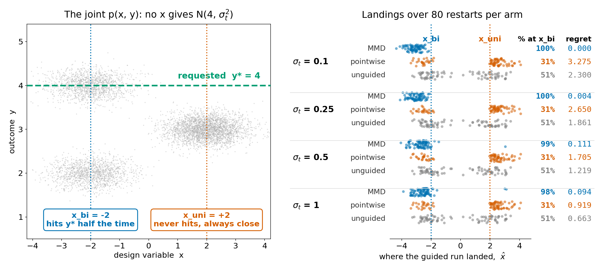

# nonstar — inverse design when no design point realises the target

You ask a generative inverse-design model for outputs distributed as
**N(y\* = 4, σ_t²)**, but **no** setting `x` of the design variable produces that
distribution. One design point (`x_bi = -2`) is *exactly right half the time*
(its conditional is bimodal on {2, 4}); the other (`x_uni = +2`) is *never right
but always close* (`N(3, 0.2²)`). The pointwise squared-error objective is
provably minimised by the one that never hits the target — `E[(y-4)²]` is 1.04
at `x_uni` vs 2.04 at `x_bi` — while distributional (MMD) matching picks the one
that actually puts mass on `y*`, in 98-100% of runs.



## Results (4 target widths × 3 arms × 2 seeds × 40 restarts)

| σ_t | MMD: % at x_bi / regret | pointwise: % at x_bi / regret | unguided: % at x_bi / regret |
|-----|------------------------|-------------------------------|------------------------------|
| 0.1  | **100%** / **0.000** | 31% / 3.275 | 51% / 2.300 |
| 0.25 | **100%** / **0.004** | 31% / 2.650 | 51% / 1.861 |
| 0.5  | **99%**  / **0.111** | 31% / 1.705 | 51% / 1.219 |
| 1.0  | **98%**  / **0.094** | 31% / 0.919 | 51% / 0.663 |

Regret = population multi-bandwidth-RBF MMD²(p(y|x̂), target) − min over x of the
same quantity, i.e. distance to the best achievable design point. The pointwise
arm is *worse than not guiding at all* on this readout.

## How it works

1. Joint GMM over `(x, y)`: components at `(-2, 2)`, `(-2, 4)`, `(+2, 3)`, weights
   `(¼, ¼, ½)`, `σ_x = 0.7`, `σ_y = 0.2` — so `p(y|x)` is closed-form.
2. `p(y|x)` is sampled through an implicit-reparameterisation oracle sampler:
   exact hard mixture samples forward, pathwise `dy/dx = -(∂F/∂x)/p(y|x)` backward.
3. Generation is a 100-step DDIM loop over `x` with the analytic `pred_x0` of the
   GMM marginal (so the prior is exact, not a trained net), `x_T ~ N(0,1)`.
4. At every step the arm's loss is differentiated back to `x_t`; the guided step is
   scaled by `1/√α_t` and capped by a trust region `τ√(1-ᾱ_t)` with `τ = 1`.
5. The three arms differ **only in the loss**: `mmd` (32 samples/step vs a fixed
   250-sample target draw), `point_sq` (1 sample/step, `(y-4)²`), `unguided` (none).
6. Ground truth: `D(x)` on a 401-point grid for population MMD² (closed form via
   Gaussian kernel integrals) and exact 1-D W2 (quantile functions); regret is
   `D(x̂) − min_x D(x)`, so no arm is graded against a target it cannot reach.

## Run it

```bash
python nonstar.py --verify    # analytic checks (conditionals, 1.04 vs 2.04, landscape argmins)
python nonstar.py --run       # 4 cells × 3 arms × 2 seeds × 40 restarts, ~1 min CPU -> results.json
python nonstar.py --figure    # results.json -> figure.png
```

Deterministic: the seeds above reproduce `results.json` exactly.

## Caveat

The pointwise arm goes to `x_uni` in 69% of restarts, not the ≥80% the
`Var + (mean − y*)²` arithmetic predicts (half its single samples land on the
`y = 4` mode, where the gradient nearly vanishes). And "closest" is
divergence-dependent: at narrow targets W2 prefers `x_uni` where MMD² prefers
`x_bi` (MMD W2-regret 0.36/0.28/0.16 at σ_t ≤ 0.5, 0.06 at σ_t = 1).

Physics copied unchanged from `experiments/infeasible_target/exp_infeasible.py`
(`--geometry sketch`); every number above reproduces it exactly.
